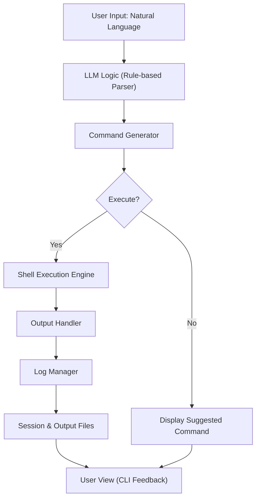
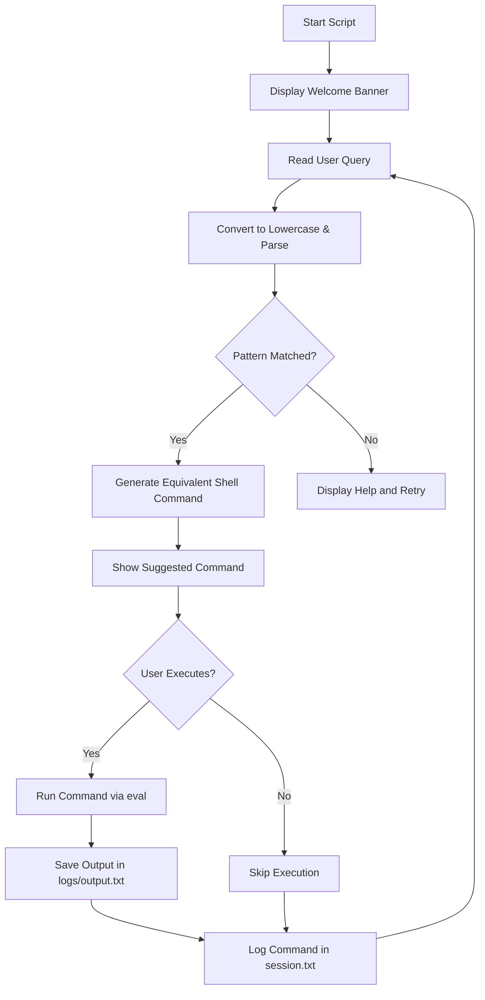

# 🧠 LLM-Backed Shell Command Assistant (Offline)
> **AI-powered natural language interface for Linux commands**

[]()
[]()
[]()

---

## 🏗️ Overview

The **LLM-Backed Shell Command Assistant** is a **smart, offline terminal assistant** written entirely in **Bash**.  
It interprets **natural language queries** from the user and intelligently constructs equivalent **Linux commands**.

It combines:
- 🧠 *AI-style reasoning* (rule-based language parsing)
- ⚙️ *Operating system concepts* (shell parsing, process creation, I/O redirection)
- 📜 *Command automation* (via pipelines and execution control)

---

## 📂 Project Structure
```
llm_shell_assistant/
│
├── app/
│ └── debug.txt # Sample application log
│
├── logs/
│ ├── output.txt # Output of last executed command
│ └── session.txt # Session history log
│
├── server/
│ └── system.txt # Sample server log
│
└── assistant.sh # Main shell assistant script
```


---

## ✨ Key Features

| Feature | Description |
|----------|-------------|
| 🗣️ **Natural Language Understanding** | Interprets user requests like “Find all .log files containing ‘error’”. |
| 🧮 **Command Construction** | Dynamically builds and suggests Linux command pipelines. |
| ⚙️ **Process Management** | Demonstrates `fork`, `exec`, and I/O redirection through Bash processes. |
| 📜 **Persistent Logs** | Stores every query, command, and result for later review. |
| 💬 **Offline LLM Simulation** | Mimics GPT-like reasoning using pattern-based AI logic. |

---

## 🧠 System Architecture

## 🔁 Internal Flow


## 💻 Example Interaction
```bash
$ bash assistant.sh
==========================================================
🧠  LLM-Backed Shell Command Assistant (Offline)
==========================================================

Enter your request (or type 'exit' to quit):
> Find all .log files modified in the last 2 days containing "error"

💡 Suggested Command:
find . -type f -name "*.log" -mtime -2 -not -path './logs/*' \
-exec grep -Hn "error" {} \; | awk -F: '{print $1":"$2":"substr($0, index($0,$3))}'

Do you want to execute it? (y/n): y

🔹 Running Command...

./server/system.log:1:2025-10-13 Critical error initializing

✅ Execution Complete
📄 Output saved to: logs/output.txt
🕒 Logged in: logs/session.txt
```
## 💻 Example Interaction(Image)
<p align="center">
  
</p>


## ⚙️ How It Works
1. **User Query** → User enters a natural language request.
2. **Parsing Engine** → Script uses pattern recognition (keywords like find, count, error, etc.).
3. **Command Construction** → Based on detected intent, constructs a valid Linux command.
4. **Execution Phase** → User can preview or execute the suggested command.
5. **Logging & Output** → Results and command history saved under /logs.

## 🧩 Demonstrated OS Concepts

| Concept | Implementation |
|----------|----------------|
| **Command Parsing** | Detects keywords in natural language and generates equivalent shell pipelines. |
| **Process Creation** | Uses Bash’s `eval` to simulate `fork` and `exec` system calls. |
| **I/O Redirection** | Redirects standard output using `tee` to store logs in files. |
| **Inter-process Communication** | Connects commands using Unix pipes (`|`) to form multi-stage processing pipelines. |


## 🪄 Sample Outputs

### 🧩 Example 1 — Counting all `.txt` files

**🗨️ User Query:**  
> Count all `.txt` files in the current directory and its subdirectories.

**💡 Generated Command:**  
```bash
find . -type f -name "*.txt" | wc -l
```
#### 📤 Sample Output:
```bash
1
```
#### 📤 Sample Output(Image):
<p align="center">
  
</p>


### 🧩 Example 2 — Displaying disk usage by directory

**🗨️ User Query:**
> Show disk usage of all folders, sorted by size.

**💡 Generated Command:**
```bash
du -sh * | sort -h
```
#### 📤 Sample Output:
```mathematica
1.0K    app
1.0K    server
8.0K    assistant.sh
8.0K    logs
```
#### 📤 Sample Output(Image):
<p align="center">
  
</p>


## 🧱 Directory Explanation

| Directory | Purpose |
|------------|----------|
| `app/` | Contains dummy application logs for searching. |
| `server/` | Simulates backend logs for testing. |
| `logs/` | Stores execution output and session history. |
| `assistant.sh` | The core intelligent shell script. |


## 🌐 Future Improvements

- 🤖 Integrate with a real LLM API (e.g., OpenAI GPT) for deeper natural language understanding
- 🧩 Add contextual query memory (multi-turn conversation support)
- 🔍 Extend to data analysis automation (e.g., summarizing log files)
- ⚡Build a web UI frontend to visualize shell execution results

## 👨‍💻 Author

**Swatadru Paul**  
- 🎓 University of Engineering and Management, Kolkata  
- 💻 Aspiring Software Development Engineer (SDE)  
- 📫 GitHub: [Click Here](https://github.com/Swatadru)
- 🌐 Portfolio: [Click Here](https://my-portfolio-eight-mocha-69.vercel.app)
- 🌐 LinkedIn: [Swatadru Paul](https://www.linkedin.com/in/swatadru-paul-79037328a/)

## 🪪 License

This project is licensed under the MIT License — free to use, modify, and distribute with attribution.

## 🌟 Acknowledgements

Inspired by the fusion of AI + System Programming, showcasing how language models can enhance shell interactions and command automation.
